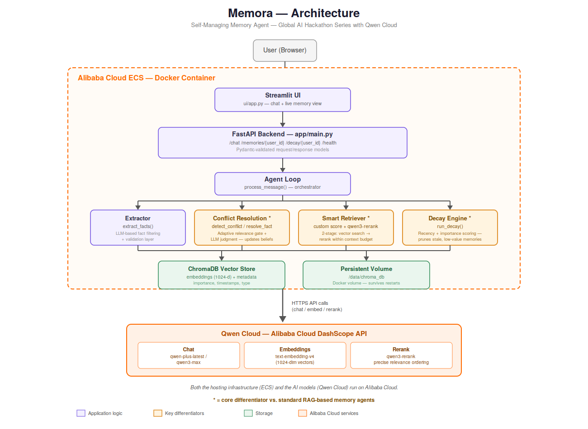

# Memora — Self-Managing Memory Agent

**A persistent memory agent that remembers what matters, forgets what doesn't, and resolves contradictions automatically.**

Built for the **Global AI Hackathon Series with Qwen Cloud** (Track 1: MemoryAgent) — powered by Alibaba Cloud's Qwen models.

---

## The Problem

LLMs are stateless — every conversation starts from zero. Most "memory" solutions either dump entire chat history into context (expensive, breaks at scale) or do naive vector retrieval (returns stale, contradictory, or irrelevant memories). Almost none handle two critical behaviors well:

- **Forgetting** outdated or low-value information over time
- **Resolving conflicts** when new information contradicts what's already stored

Memora is built specifically to solve both.

---

## What Makes Memora Different

Most memory agents are basic RAG over chat history. Memora goes further with three engineered differentiators:

### 1. Conflict Resolution
When a new fact contradicts an existing memory (*"User is vegetarian"* → *"started eating chicken"*), Memora detects it and **updates the belief** instead of storing both and retrieving randomly.

- An **adaptive relevance gate** (distance-based pre-filter) decides which existing memories are worth checking
- An LLM judgment call (Qwen) classifies the relationship: `contradict` / `duplicate` / `compatible`
- Outdated memories are deleted and replaced; duplicates are skipped; compatible facts are kept alongside

### 2. Decay (Forgetting)
Memories are scored by a blend of **importance**, **recency**, and **freshness**, using exponential decay (30-day half-life). Memories that fall below a relevance floor are pruned — while high-importance memories (e.g. allergies) resist decay even as they age.

### 3. Smart Retrieval
A two-stage retrieval pipeline:
1. Vector search narrows a wide candidate pool using a custom relevance score (similarity + importance + recency)
2. **`qwen3-rerank`** performs final precision reordering on the narrowed set

This mirrors Qwen's own recommended RAG pattern: *retrieve many → rerank to top few → pass to the LLM* — ensuring the most critical memories are recalled within a limited context window.

---

## Architecture



```
User → Streamlit UI → FastAPI Backend → Agent Loop
                                            │
                ┌───────────────┬───────────┼───────────────┐
                ▼               ▼           ▼               ▼
           Extractor     Conflict ★    Retriever ★      Decay ★
                │               │           │               │
                └───────────────┴─────┬─────┴───────────────┘
                                       ▼
                              ChromaDB Vector Store
                                       │
                                       ▼
                     Qwen Cloud (Alibaba Cloud DashScope API)
                     Chat · Embeddings · Rerank
```

Both the backend hosting (Alibaba Cloud ECS) and the AI models (Qwen Cloud) run on Alibaba Cloud infrastructure.

---

## Tech Stack

| Layer | Technology |
|---|---|
| LLM (reasoning) | `qwen-plus-latest`, `qwen3-max-2025-09-23` via Qwen Cloud |
| Embeddings | `text-embedding-v4` (1024-dimensional vectors) |
| Reranking | `qwen3-rerank` |
| Vector store | ChromaDB (persistent, local disk) |
| Backend | FastAPI |
| Frontend | Streamlit |
| Deployment | Docker → Alibaba Cloud ECS |

---

## Project Structure

```
memora-agent/
├── app/
│   ├── main.py              # FastAPI app — /chat, /memories, /decay, /health
│   ├── config.py            # Central settings, loads .env safely
│   ├── memory/
│   │   ├── extractor.py     # Pulls memory-worthy facts from raw messages
│   │   ├── store.py         # ChromaDB read/write
│   │   ├── conflict.py      # Conflict detection + resolution (★)
│   │   ├── decay.py         # Forgetting / relevance decay (★)
│   │   └── retriever.py     # Custom scoring + qwen3-rerank (★)
│   └── agent/
│       ├── llm_client.py    # Qwen API wrapper (chat + embeddings)
│       └── agent_loop.py    # Orchestrates the full pipeline
├── ui/
│   └── app.py                # Streamlit chat + live memory visualization
├── docs/
│   ├── architecture_diagram.png
│   └── architecture_diagram.svg
├── deploy/
│   ├── Dockerfile
│   └── docker-compose.yml
├── data/                      # ChromaDB storage (gitignored)
├── requirements.txt
└── .env                        # API keys (gitignored, never committed)
```

---

## Setup

**1. Clone and create a virtual environment**
```bash
python -m venv venv
venv\Scripts\activate        # Windows
```

**2. Install dependencies**
```bash
pip install -r requirements.txt
```

**3. Configure environment variables** — create a `.env` file:
```
QWEN_API_KEY=your-key-here
QWEN_BASE_URL=https://dashscope-intl.aliyuncs.com/compatible-mode/v1
```

**4. Run the backend**
```bash
uvicorn app.main:app --reload
```

**5. Run the UI** (in a separate terminal)
```bash
streamlit run ui/app.py
```

The UI will open at `http://localhost:8501` and connect to the API at `http://127.0.0.1:8000`.

---

## API Endpoints

| Method | Endpoint | Description |
|---|---|---|
| `GET` | `/health` | Liveness check |
| `POST` | `/chat` | Send a message, get a memory-grounded reply + memory actions taken |
| `GET` | `/memories/{user_id}` | List all stored memories for a user |
| `POST` | `/decay/{user_id}` | Trigger forgetting for a user |

Interactive API docs available at `/docs` once the server is running.

---

## How It Works — End to End

1. **User sends a message** → arrives at `/chat`
2. **Extraction** — `extract_facts()` pulls clean, structured facts from the raw message, filtering out filler and chitchat
3. **Conflict resolution** — each fact is checked against existing memories; contradictions trigger an update, duplicates are skipped, new facts are added
4. **Retrieval** — relevant memories are pulled via vector search, scored, and reranked
5. **Response generation** — Qwen generates a reply grounded in the retrieved memories
6. **Decay** (on demand) — stale, low-importance memories are pruned in the background

---

## Deployment

Memora is containerized with Docker and designed to run on Alibaba Cloud ECS, with the FastAPI backend exposed via a public endpoint and ChromaDB persisted to a mounted volume.

---

## License

MIT

---

## Author

**Ahmad Hassan** — Master's student in AI/NLP, Harbin Institute of Technology, Shenzhen
Built for the Global AI Hackathon Series with Qwen Cloud (2026)